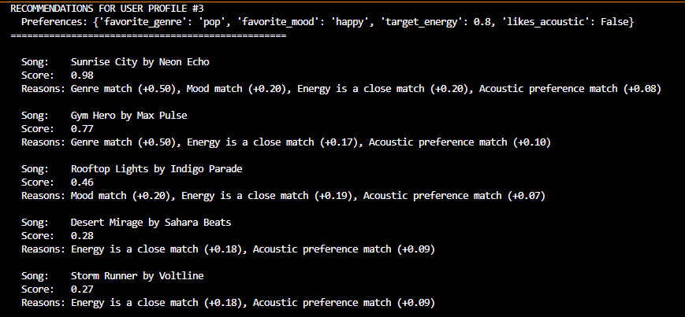

# 🎵 Music Recommender Simulation

## Project Summary

In this project you will build and explain a small music recommender system.

Your goal is to:

- Represent songs and a user "taste profile" as data
- Design a scoring rule that turns that data into recommendations
- Evaluate what your system gets right and wrong
- Reflect on how this mirrors real world AI recommenders
- Provide recommendation reasoning explanation for each song recommendation.


---

## How The System Works

Explain your design in plain language.

Some prompts to answer:

- What features does each `Song` use in your system
  - For example: genre, mood, energy, tempo
- What information does your `UserProfile` store
- How does your `Recommender` compute a score for each song
- How do you choose which songs to recommend

You can include a simple diagram or bullet list if helpful.

Scoring: Each song is compared to the user's preferences.

Categorical Features: A song gets a high score if its genre or mood directly matches the user's favorites.
Numerical Features: For energy and acousticness, the system calculates a similarity score—the closer the song's attribute is to the user's preference, the higher the score.
Weighting: These individual scores are combined into a final "Total Score." To ensure the most important factors have the biggest impact, matches are weighted, with genre having the most influence (50%), followed by mood (20%), energy (20%), and acousticness (10%).

Ranking: Finally, the system ranks all the songs by their Total Score and returns the top results. This entire process ensures that the final recommendations are a balanced blend of matching the user's core tastes while also considering the finer details of the music.

---

## Getting Started

### Setup

1. Create a virtual environment (optional but recommended):

   ```bash
   python -m venv .venv
   source .venv/bin/activate      # Mac or Linux
   .venv\Scripts\activate         # Windows

2. Install dependencies

```bash
pip install -r requirements.txt
```

3. Run the app:

```bash
python -m src.main
```

### Running Tests

Run the starter tests with:

```bash
pytest
```

You can add more tests in `tests/test_recommender.py`.

---

## Experiments You Tried

Use this section to document the experiments you ran. For example:

- What happened when you changed the weight on genre from 2.0 to 0.5
- What happened when you added tempo or valence to the score
- How did your system behave for different types of users

---

## Limitations and Risks

Summarize some limitations of your recommender.

Examples:

- It only works on a tiny catalog
- It does not understand lyrics or language
- It might over favor one genre or mood

You will go deeper on this in your model card.

---The recommender is stateless. It cannot learn from a user's past interactions. Also, it is purely content-based system, so it will only recommend songs that are similar to what the user already likes. It will struggle to introduce the user to completely new and different genres or artist they might enjoy. The UserProfile simplifies human taste significantly. It does not account for preferences related to danceability, valece, or tempo. In addition, the recommenders world is limited to the songs listed in the songs.csv file. The weights I defined in the score_song function are based on my own assumptions about what makes a good recommendation. Users whose tastes don't fit the rigid structure of the UserProfile or the assumptions in the scoring weights will receive poor, unsatisfying recommendations.

## Reflection

Read and complete `model_card.md`:

[**Model Card**](model_card.md)

Write 1 to 2 paragraphs here about what you learned:

- about how recommenders turn data into predictions
- about where bias or unfairness could show up in systems like this


---I learned about the difference between collaborative and content-based filtering and how many larger streaming companies utilize a mixture of both to recommend similar and new music to listeners. It is really interesting to me what goes on behind the logic of those recommendations. Bias could show up in the system in the form of the dataset itself or algorithmic bias. Although, my dataset is diverse, it is small, as a result a user that likes one of those genres will get very few, if any , recommendations. The initial 10 songs were heavily focused on modern electronic-influenced genres like pop, lofi, and synthwave. If I hadn't added more variety, the system would have a strong bias towards this type of music, creating a "filter bubble" where users are never exposed to anything else. The concepts of energy or mood might be interpreted differently across cultures. A song considered "happy" in one culture might be perceived differently in another. In your score_song function, we assigned genre a weight of 0.5. This means a genre match is considered overwhelmingly important. This creates a bias where the system will almost always favor a song of the correct genre, even if its other attributes are a poor match. While my system doesn't explicitly track popularity, real-world systems often do. They tend to recommend what is already popular, creating a feedback loop where popular artists get more popular, and emerging artists are ignored.

## 7. `model_card_template.md`

Combines reflection and model card framing from the Module 3 guidance. :contentReference[oaicite:2]{index=2}  

```markdown
# 🎧 Model Card - Music Recommender Simulation

## 1. Model Name

Give your recommender a name, for example:

> TuneTailor 1.0

---

## 2. Intended Use

- What is this system trying to do
- Who is it for

Example:

> This model suggests 3 to 5 songs from a small catalog based on a user's preferred genre, mood, and energy level. It is for classroom exploration only, not for real users.

---This system recommends a handful of songe from a small, predefined catalog. It makes these suggestions by matching song attributes to a user's explicitly stated preferences for genre, mood, energy, and acoustic sound. This model is designed purely for educational and simulation purposes to demonstrate the core concepts of a content-based recommender; it is not intended for real-world application with actual users.

## 3. How It Works (Short Explanation)

Describe your scoring logic in plain language.

- What features of each song does it consider
- What information about the user does it use
- How does it turn those into a number

Try to avoid code in this section, treat it like an explanation to a non programmer.

---This recommender works by scoring every song in its catalog against a user's taste profile to find the best matches
- It looks at four main features of a song: its genre (like 'pop' or 'rock'), its mood (like 'happy' or 'chill'), its energy level, and its acousticness (how much of the track is non-electric).
-  It uses a simple "taste profile" that stores the user's favorite genre, favorite mood, a target energy level they're looking for, and whether or not they like acoustic music.
- The system compares a song's features to the user's profile and awards points. A match in genre is worth the most points, followed by a mood match. It also awards points if a song's energy is very close to the user's target, and for how well its acoustic level matches the user's preference. These points are added up to create a final "similarity score" for the song. The higher the score, the better the recommendation.

## 4. Data

Describe your dataset.

- How many songs are in `data/songs.csv`
- Did you add or remove any songs
- What kinds of genres or moods are represented
- Whose taste does this data mostly reflect

--- There are 17 songs in the songs.csv dataset. With the help of Copilot, I added 7out of the 17 songs. The dataset is diverse and includes a mix of electronic and acousticc, mainstream niche genres such as pop, lofi, rock, ambient, jazz, synthwave, indie pop, electronic, reggae, country, and classical. The moods that are represented are happy, chill, intense, relaxed, moody, focused, energetic, uplifting, sad, peaceful, epic, thoughtful, and nostalgic. The dataset does not reflect a single person's taste. It is a curated collection designed for testinf a recommender system.

## 5. Strengths

Where does your recommender work well

You can think about:
- Situations where the top results "felt right"
- Particular user profiles it served well
- Simplicity or transparency benefits

---My recommender can explain exactly why it chose a particular song. The recommendations are a direct and istant reflection of the user's stated preferences. The design is easy to understand since the entire logic is contained in a few functions , which is eficient for small-to-medium sized catalog of songs. It worked well with the default user profile which included pop as the genre and happy as the mood. 


## 6. Limitations and Bias

Where does your recommender struggle

Some prompts:
- Does it ignore some genres or moods
- Does it treat all users as if they have the same taste shape
- Is it biased toward high energy or one genre by default
- How could this be unfair if used in a real product

---The recommender is stateless. It cannot learn from a user's past interactions. Also, it is purely content-based system, so it will only recommend songs that are similar to what the user already likes. It will struggle to introduce the user to completely new and different genres or artist they might enjoy. The UserProfile simplifies human taste significantly. It does not account for preferences related to danceability, valece, or tempo. In addition, the recommenders world is limited to the songs listed in the songs.csv file. The weights I defined in the score_song function are based o nour own assumptions about what makes a good recommendation.

## 7. Evaluation

How did you check your system

Examples:
- You tried multiple user profiles and wrote down whether the results matched your expectations
- You compared your simulation to what a real app like Spotify or YouTube tends to recommend
- You wrote tests for your scoring logic

You do not need a numeric metric, but if you used one, explain what it measures.

---I tried multiple user profiles to see if the results matched what I was expecting. I asked Copilot to generate some tests in this projects test_recommender. py file. I added scoring logic that worked with a small-to-medium scale dataset. 


## 8. Future Work

If you had more time, how would you improve this recommender

Examples:

- Add support for multiple users and "group vibe" recommendations
- Balance diversity of songs instead of always picking the closest match
- Use more features, like tempo ranges or lyric themes

---I would add more attributes to be stored into UserProfile so that the scoring would better match songs based on all the usual data types including danceability, valence, and tempo. Also, I would add more songs to the songs.csv file.

## 9. Personal Reflection

A few sentences about what you learned:

- What surprised you about how your system behaved
- How did building this change how you think about real music recommenders
- Where do you think human judgment still matters, even if the model seems "smart"

- I was surprised that my system matched recommendations well when it came to similar genres, although the dataset was small. Building this recommender opened my eyes to the different methods that are used in larger recommenders and the many data types and user data that are taken into account when recommending similar music or recommend new music. I think human judgemnt matters when it comes to how to weigh different data types. The weight of each data type really depends on the Company and their own opinion on what is more important. 