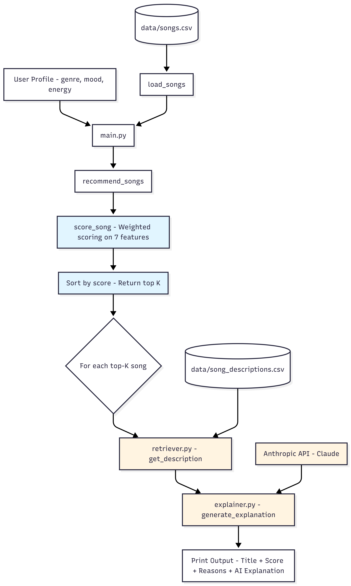
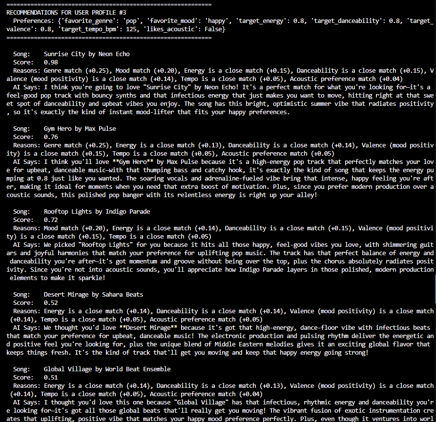
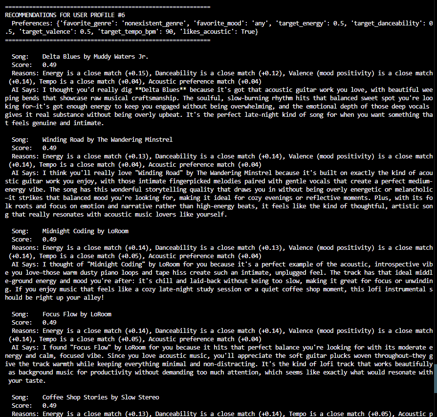

# 🎵 Applied AI System: Music Recommender with RAG

> An applied AI system that extends a content-based music recommender with a Retrieval-Augmented Generation (RAG) layer to produce warm, human-sounding explanations grounded in a curated knowledge base.

## 📌 Project Overview

This project extends my **Module 3 Music Recommender Simulation** into a full applied AI system. The original system used a weighted-score algorithm to rank songs based on user preferences. This extension adds a **RAG (Retrieval-Augmented Generation)** layer that retrieves rich descriptions from a knowledge base and uses Claude (Anthropic's LLM) to generate natural, conversational explanations of *why* each song was recommended.

The result is an AI system that doesn't just produce numbers — it produces **trustworthy recommendations** where users can see both the math (the original score breakdown) **and** the prose (the AI explanation), allowing them to verify the AI's reasoning at a glance.

### Base Project

This project is built on top of my Module 3 submission:
**[Music Recommender Simulation](https://github.com/isabelpedroza18-sys/ai110-module3show-musicrecommendersimulation-starter)**

The original scoring engine remains untouched in `src/recommender.py`. The RAG layer was added as a new, additive module — clean separation of concerns.

---

## 🏗️ System Architecture



The data flow:

1. **Input** — User profile dictionary (favorite genre, mood, energy targets, etc.)
2. **Existing scoring engine** — `load_songs()` reads the catalog, `recommend_songs()` loops through every song calling `score_song()`, then sorts and returns the top K.
3. **NEW — Retrieval (R)** — For each top-K song, `retriever.py` looks up a rich description from `data/song_descriptions.csv`.
4. **NEW — Augmentation (A)** — `explainer.py` builds a prompt combining user prefs, song metadata, score breakdown, reasons, AND the retrieved description.
5. **NEW — Generation (G)** — Claude (`claude-haiku-4-5`) generates a 2-3 sentence natural-language explanation.
6. **Output** — Terminal prints the song title, score, original reasons, AND the AI explanation.

---

## ✨ Key Features

- **Weighted-score recommender** with 7 features (genre, mood, energy, danceability, valence, tempo, acousticness)
- **Custom knowledge base** of 27 hand-curated song descriptions with mixed style (vibe, story, recommendation framing)
- **RAG pipeline** producing grounded, conversational explanations via Claude API
- **Graceful failure handling** — if the LLM call fails, the original scoring output is still shown (built-in reliability)
- **Adversarial testing** — system tested against profiles with nonexistent genres, conflicting preferences, and edge cases
- **Transparent dual-output** — users see both the numeric score breakdown AND the AI prose, so the AI's reasoning is always verifiable

---

## 🚀 Getting Started

### Prerequisites

- Python 3.9+
- An [Anthropic API key](https://console.anthropic.com)

### Setup

1. **Clone the repo**
   ```bash
   git clone https://github.com/isabelpedroza18-sys/applied-ai-system-project.git
   cd applied-ai-system-project
   ```

2. **Create and activate a virtual environment**
   ```bash
   python -m venv .venv
   .venv\Scripts\activate      # Windows
   source .venv/bin/activate   # Mac/Linux
   ```

3. **Install dependencies**
   ```bash
   pip install -r requirements.txt
   ```

4. **Set up your API key**

   Create a file named `.env` in the project root with this single line:
   ```
   ANTHROPIC_API_KEY=your_api_key_here
   ```

   ⚠️ **Never commit your `.env` file.** It is already listed in `.gitignore`.

5. **Run the recommender**
   ```bash
   python -m src.main
   ```

### Running Tests

```bash
pytest
```

---

## 📊 Demo Output

### "Pop / Happy" user profile

A standard happy-path test showing the system working as intended:



Each recommendation shows the original score, the matching reasons (transparent math), AND a warm AI-generated explanation that ties the song's vibe to the user's stated preferences.

### Adversarial profile (nonexistent genre)

A stress test showing how the system handles edge cases gracefully:



Even when the user has impossible or conflicting preferences, the system produces sensible, honest explanations rather than crashing.

---

## 🎥 Video Walkthrough

📺 **Loom video walkthrough:** _[Link will be added here after recording]_

The walkthrough demonstrates:
- End-to-end system run with 2-3 different inputs
- The RAG layer in action (retrieval + LLM generation)
- Reliability behavior (graceful fallback if API fails)
- Clear outputs for each test case

---

## 📁 Project Structure

```
applied-ai-system-project/
├── assets/
│   ├── architecture.png              # System architecture diagram
│   ├── output_pop_profile3.png       # Demo screenshot - happy path
│   └── output_adversarial_profile6.png  # Demo screenshot - edge case
├── data/
│   ├── songs.csv                     # Song catalog (27 songs)
│   └── song_descriptions.csv         # NEW: RAG knowledge base
├── src/
│   ├── recommender.py                # Existing scoring engine (untouched)
│   ├── retriever.py                  # NEW: Retrieval module (R in RAG)
│   ├── explainer.py                  # NEW: Augmentation + Generation (A + G in RAG)
│   └── main.py                       # Updated to wire RAG into the pipeline
├── tests/
│   └── test_recommender.py           # Existing unit tests
├── .env                              # API key (gitignored)
├── .gitignore
├── model_card.md                     # Model card with reflection
├── README.md                         # This file
└── requirements.txt
```

---

## 🧪 How It Was Tested

The system was evaluated using **6 distinct user profiles**, including:

- **3 standard profiles** — indie-pop/chill, rock/intense, pop/happy
- **3 adversarial profiles** — nonexistent genres, conflicting preferences (high energy + sad mood), unusual feature combinations

For each profile, the top 5 recommendations were inspected for:

1. **Accuracy** — Do the top results match what a human would expect?
2. **Reasoning quality** — Does the AI explanation correctly connect the song's vibe to the user's preferences?
3. **Robustness** — Does the system handle edge cases without crashing?
4. **Reliability** — Does the fallback message appear cleanly when the API is unreachable?

Results, observations, and biases discovered during testing are documented in detail in [`model_card.md`](model_card.md).

---

## 🤔 Personal Reflection

> **What this project says about me as an AI engineer:**

This project taught me that responsible AI engineering isn't just about getting a model to work — it's about designing systems that are *transparent, verifiable, and robust*. By keeping my original scoring engine intact and layering RAG on top of it, I built a system where users can always see both the math and the AI's interpretation. That dual-output design wasn't an accident — it was an intentional choice to make the system trustworthy.

The biggest learning moment was realizing that "RAG" isn't one specific technology — it's a *pattern*. My retrieval step uses a simple CSV lookup, but the same architecture would scale to a vector database with millions of documents. Understanding the pattern is what matters; the implementation can grow with the use case.

I also learned how much **prompt design** affects output quality. My first explainer prompt produced generic, repetitive text. By carefully structuring the prompt with clear sections (user preferences, song info, score, reasons, description) and explicit task instructions, I got Claude to produce explanations that feel genuinely warm and personalized.

If I extended this further, I'd add semantic retrieval (using embeddings) so the system could find descriptions matching user intent rather than relying on song-ID lookups, and I'd build a small evaluation harness to measure explanation quality across many profiles automatically.

---

## 📜 License

For educational use as part of the AI 110 course.
